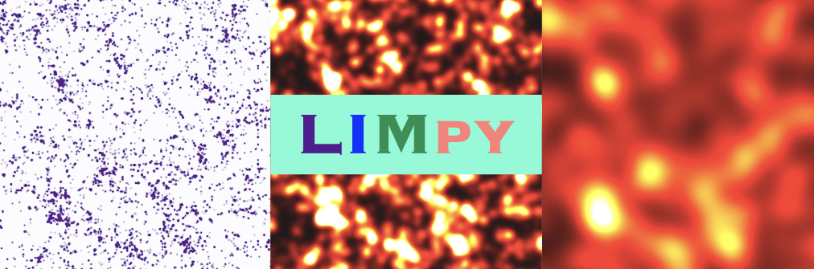

# LIMpy
_A python package for multi-line intensity mapping_

### Description
LIMpy is code for modelling multi-line intensity maps of CII (158 $\mu m$), OIII (88 $\mu m$), and CO (1-0) to CO (13-12) transitions. 
This code can be used for following things:
* Analytic model for star formation rate
* Multi-line luminosity models
* Multi line intensity power spectrum based on Halo model approach
* Simulate line intensity maps based on halo cataloig
* Calculate power spectrum from simulated maps in cube and rectangular box
* Apply Gaussian beam convolution 
* Can be used to quantify interlopers, signal-to-noise ratio, etc.

### Requirements 
This code uses mainly three external packages:
* [CAMB](https://github.com/cmbant/CAMB): Used to calculate the matter power spectrum. 
* [Colossus](https://bdiemer.bitbucket.io/colossus/): Used mainly to calculate halo mass function. 
* [Astropy](https://www.astropy.org/): Used to implement beam convolution. 
    

### Installation
You can install **LIMpy** by cloning the package directly from GitHub.

<code>
    git clone https://github.com/Anirbancosmo/Limpy.git
    cd Limpy
    python setup.py install
</code>

### Initialization
Set the default cosmological and Astrophysical parameters in input.py file. These parameters will be used to fix the halo mass function.

### Examples
See my [examples](examples/) folder for a quick start.

[luminosity_and_sfr](examples/luminosity_and_sfr.ipynb) : Check the available models for star formation rate and line luminosities. 

[powerspectra-halo-model.ipynb](examples/powerspectra-halo-model.ipynb): examples that show how to calculate line intensity power spectra based on halo model approach. 

[Simulated_maps_and_powerspectra.ipynb](examples/Simulated_maps_and_powerspectra.ipynb): some examples that show how to paint various line intensities on an external halo catalogue. 

### Citation
If you find this package (or the paper) helpful in your research, please cite the following paper.

    @article{Roy:2023,
    author = "Roy, Anirban and Valent\'in-Mart\'inez, Dariannette and Wang, Kailai and Battaglia, Nick and van Engelen, Alex",
    title = "{$\texttt{𝙻𝙸𝙼𝚙𝚢}$ : A Semi-analytic Approach to Simulating Multi-line Intensity Maps at Millimetre Wavelengths}",
    eprint = "2304.4842106",
    archivePrefix = "arXiv",
    primaryClass = "astro-ph.CO",
    month = "4",
    year = "2023"}
    
### Contact
Anirban Roy (ar689@cornell.edu)
